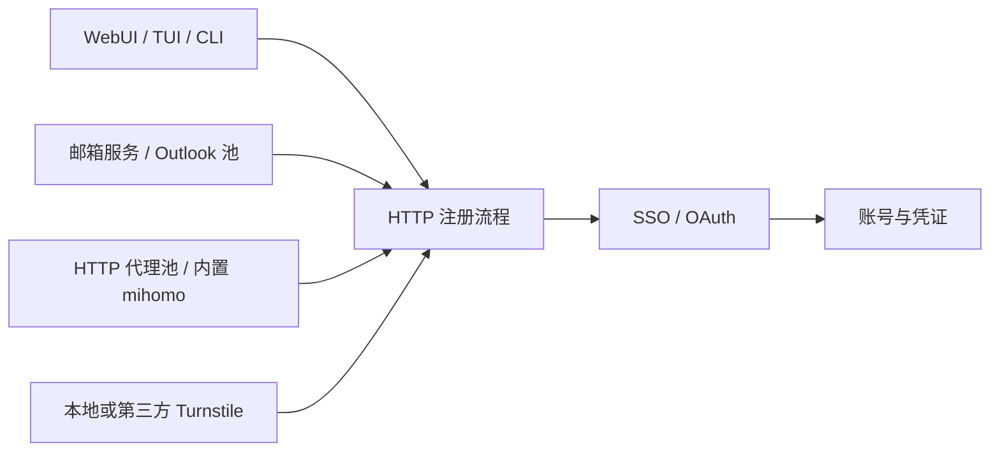

<div align="center">

[](https://github.com/AaronL725/grok-register)

# Grok Register

HTTP 优先的注册与凭证管理工具，提供 WebUI、TUI 和 CLI，并集成邮箱、代理、Turnstile、OAuth 与 CPA 管理能力。

<p>
  <a href="LICENSE"></a>
  
  
</p>

</div>

## 功能

- **多入口**：WebUI、全屏 TUI、直接 CLI。
- **HTTP 主流程**：注册、邮箱验证码、SSO 获取和 OAuth 凭证转换均由 HTTP 流完成。
- **邮箱接入**：支持 Cloudflare、YYDS 和 Outlook / Microsoft Graph 邮箱池。
- **Turnstile**：支持本地 Chrome，也支持 CapSolver、YesCaptcha 和 2Captcha。
- **代理出口**：支持单代理、静态 HTTP 代理池、订阅导入和内置 mihomo 节点。
- **批次运行**：提供并发控制、代理租约、有界重试、历史记录和停止清理。
- **凭证管理**：WebUI 内查看、导出 OAuth 凭证，并可对接 CPA 管理接口。
- **持续任务**：提供 Outlook / Graph 邮箱池监督器，支持断点续跑。

## 流程示意



注册主链保持 HTTP；只有选择 `turnstile_provider=local` 时会启动本地 Chrome。

## 部署

### 环境要求

- Python 3.10+
- Google Chrome 或 Chromium（仅本地 Turnstile 求解需要）
- mihomo 可执行文件（仅启用内置节点时需要）

### Linux / macOS

```bash
git clone <repository-url>
cd grok-protocol

python3 -m venv .venv
source .venv/bin/activate
python -m pip install -r requirements.txt

mkdir -p .local
cp config.example.json .local/config.json

./webui.sh
```

浏览器打开：<http://127.0.0.1:33844>

### Windows PowerShell

```powershell
git clone <repository-url>
Set-Location grok-protocol

py -3 -m venv .venv
.\.venv\Scripts\Activate.ps1
python -m pip install -r requirements.txt

New-Item -ItemType Directory -Force .local | Out-Null
Copy-Item config.example.json .local\config.json

python webui_app.py --host 127.0.0.1 --port 33844
```

浏览器打开：<http://127.0.0.1:33844>

### 远程服务器

WebUI 默认只监听 `127.0.0.1`。从本机通过 SSH 访问远程部署：

```bash
ssh -L 33844:127.0.0.1:33844 user@server
```

随后在本机打开 <http://127.0.0.1:33844>。

## 配置

默认配置文件为 `.local/config.json`。首次启动后也可直接在 WebUI 的“配置中心”完成设置。

| 配置 | 作用 |
| --- | --- |
| `email_provider` | `cloudflare`、`yyds`、`msgraph` |
| `ms_mail_file` | Outlook / Graph 邮箱池文件，建议放在 `fixtures/` |
| `turnstile_provider` | `local`、`capsolver`、`yescaptcha`、`2captcha` |
| `turnstile_api_key` | 第三方 Turnstile 服务密钥 |
| `proxy` | 单个注册代理 |
| `proxy_file` | HTTP 代理池文件，默认 `fixtures/proxies.txt` |
| `proxy_subscription_urls` | 一个或多个代理订阅地址 |
| `embedded_proxy_enabled` | 是否启用内置 mihomo 节点 |
| `concurrent_workers` | 注册并发数 |
| `xai_oauth_output_dir` | OAuth 凭证输出目录，默认 `credentials` |

内置 mihomo、求解代理、CPA 推送等选项均可在 WebUI 中配置。完整字段参考 [`config.example.json`](config.example.json)。

## 使用

### WebUI（推荐）

```bash
./webui.sh
```

- 运行台：创建和停止批次、查看日志与历史记录。
- 配置中心：配置邮箱、代理、Turnstile、输出和 CPA。
- 凭证列表：查看与导出 OAuth 凭证。
- CPA 巡检：访问 <http://127.0.0.1:33844/cpa>。

自定义监听或配置文件：

```bash
python webui_app.py \
  --config /path/to/config.json \
  --host 127.0.0.1 \
  --port 33844
```

也可使用环境变量 `XAI_CONFIG_PATH`、`XAI_WEBUI_HOST` 和 `XAI_WEBUI_PORT`。

### TUI

```bash
./http_tui.sh
```

只查看本次运行计划：

```bash
./http_tui.sh --config .local/config.json --count 3 --workers 2 --dry-run
```

### CLI

探测邮箱：

```bash
python xai_http_flow.py mail-probe --mail-config .local/config.json
```

执行一次注册：

```bash
python xai_http_flow.py register \
  --mail-config .local/config.json \
  --turnstile-provider local
```

从已有 SSO 生成 OAuth 凭证：

```bash
python xai_http_flow.py credential \
  --sso-file .local/fixtures/sso.txt
```

查看全部子命令：

```bash
python xai_http_flow.py --help
```

## 本地目录

```text
.local/
├── config.json       # 当前配置
├── fixtures/         # 邮箱池、代理池等输入
├── accounts/         # 注册结果
├── credentials/      # OAuth 凭证
├── runs/             # 批次日志与历史
├── exports/          # 导出文件
└── state/            # mihomo、Turnstile 等运行状态
```

## 部署验证

启动 WebUI 后检查健康接口：

```bash
curl http://127.0.0.1:33844/api/health
```

运行测试：

```bash
python -m pytest -q
```

更多命令、邮箱池格式和故障排查见 [`USAGE.md`](USAGE.md)。

## License

[MIT](LICENSE)
