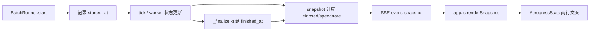

# WebUI「注册到凭证」平均速度 / 成功率 设计

日期：2026-07-11  
范围：仅 WebUI 运行台进度区渲染  
状态：已确认

## 1. 背景与目标

当前 WebUI 进度区只显示：

```text
run=... | 完成 x/y | 成功 a | 失败 b | 活动 c
```

缺少「从注册启动到凭证产出」的整体效率指标。  
本需求补上两个实时指标：

1. **平均速度**：成功凭证数 / 已用时间
2. **成功率**：成功数 / 已完成数

## 2. 非目标

- 不改 TUI 文本界面
- 不改历史列表 UI（`summary.json` 会自然带上字段，但本需求不渲染历史）
- 不做 worker 级起止耗时明细
- 不新增独立 API；继续复用现有 snapshot / SSE

## 3. 指标口径

| 指标 | 公式 | 展示 |
|---|---|---|
| 平均速度 | `succeeded / (elapsed_sec / 60)` | `X.X 个/分钟` |
| 成功率 | `succeeded / completed` | `XX.X%` |
| 耗时 | `elapsed_sec` | `Xs` 或 `XmYs` |

边界规则：

- `elapsed_sec < 1` 或未启动：速度显示 `-`
- `completed == 0`：成功率显示 `-`
- 时间从批次真正 `BatchRunner.start()` 起算
- 批次 `_finalize()` 后冻结最终耗时，避免完成后继续涨
- “成功”定义与现有一致：worker `status == "succeeded"`
  - 模式1：注册成功
  - 模式2：注册 + SSO 转凭证成功

## 4. 方案选择

采用 **后端补字段 + 前端只渲染**。

原因：

- 数字口径统一，刷新 / SSE 重连后不漂
- snapshot 与 `summary.json` 可复用
- 测试容易写

不采用纯前端计时（重连后时间不准），也不做 worker 级明细（对本需求过重）。

## 5. 后端设计

文件：`http_batch_service.py`

### 5.1 BatchRunner 新增状态

- `started_at_wall: Optional[str]`
  - 墙钟时间，ISO 本地时间字符串，便于日志/摘要
- `started_at_monotonic: Optional[float]`
  - `time.monotonic()`，用于稳定计时
- `finished_at_monotonic: Optional[float]`
  - `_finalize()` 时写入

### 5.2 生命周期

1. `start()`：
   - 若尚未 started，记录 `started_at_wall` 与 `started_at_monotonic`
2. 运行中：
   - `elapsed_sec = floor(now_monotonic - started_at_monotonic)`
3. `_finalize()`：
   - 记录 `finished_at_monotonic`
   - 之后 `elapsed_sec` 使用 `finished - started`
4. `snapshot()` / `_write_summary_json()`：
   - 输出下列字段

### 5.3 snapshot 新增字段

| 字段 | 类型 | 含义 |
|---|---|---|
| `started_at` | `string \| ""` | 开始时间（墙钟） |
| `elapsed_sec` | `int` | 已用秒数 |
| `avg_success_per_min` | `float \| null` | 平均成功速度（个/分钟） |
| `success_rate` | `float \| null` | 成功率，0~1 |

计算伪代码：

```python
if not started_at_monotonic:
    elapsed_sec = 0
elif finished_at_monotonic is not None:
    elapsed_sec = int(finished_at_monotonic - started_at_monotonic)
else:
    elapsed_sec = int(time.monotonic() - started_at_monotonic)

avg_success_per_min = (
    None if elapsed_sec < 1 else succeeded / (elapsed_sec / 60.0)
)
success_rate = (
    None if completed == 0 else succeeded / completed
)
```

现有字段（`completed/succeeded/failed/active/...`）保持不变。

## 6. 前端设计

文件：

- `webui/static/app.js`
- `webui/static/app.css`（仅必要时微调 `.stats` 两行显示）
- `webui/templates/index.html`（默认不改结构，仍用 `#progressStats`）

### 6.1 渲染

`renderSnapshot(snap)` 将进度文案改为两行：

```text
run=... | 完成 12/20 | 成功 10 | 失败 2 | 活动 3
速度 2.5 个/分钟 | 成功率 83.3% | 耗时 4m12s
```

格式规则：

- 速度：`null` → `-`；否则保留 1 位小数
- 成功率：`null` → `-`；否则百分比 1 位小数
- 耗时：
  - `< 60s` → `Xs`
  - 否则 → `XmYs`

前端不自己重算速度/成功率，只格式化后端字段，避免双口径。

### 6.2 样式

`.stats` 保持等宽数字；允许换行显示第二行即可。不新增复杂图表或卡片。

## 7. 数据流



## 8. 测试计划

优先补后端单元测试（`tests/test_http_batch_service.py`）：

1. 未启动：`elapsed_sec=0`，`avg_success_per_min=null`，`success_rate=null`
2. 运行中：人为注入 started_at 与 succeeded/completed，断言速度与成功率
3. 已完成：`finished_at` 冻结后，再次 snapshot 耗时不变
4. `completed=0` 时成功率 `null`
5. `elapsed_sec=0` 时速度 `null`

前端以手工验证为主：

- 启动批次后第二行出现
- 成功增加时速度/成功率变化
- 完成后数值稳定

## 9. 风险与取舍

| 风险 | 处理 |
|---|---|
| 刚启动 0~1 秒速度无意义 | `elapsed_sec < 1` 显示 `-` |
| 停止中的任务算失败 | 与现有 `failed` 定义一致（`failed+stopped`） |
| 模式2 转换慢会拉低速度 | 符合“注册到凭证”全链路口径 |
| 历史页暂不展示 | 字段已进 summary，后续可复用 |

## 10. 验收标准

- 运行台进度区实时显示平均速度与成功率
- 口径符合第 3 节
- 不破坏现有完成/成功/失败/活动统计
- 相关后端测试通过
- 不改 TUI / 历史列表 UI
