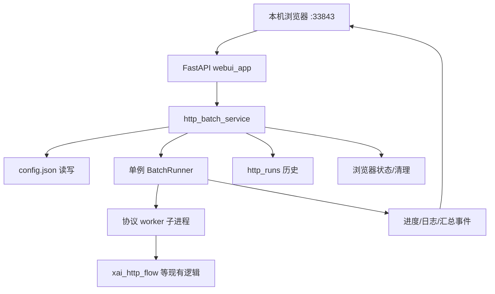

# xAI HTTP 协议 WebUI 设计

日期：2026-07-11  
状态：已通过（待实现计划）  
范围：用本机 Web 控制台替换 curses TUI 作为日常主入口

## 1. 背景与目标

### 1.1 背景

当前批量入口是 `http_tui.py`（curses）。在 local Turnstile、多 worker 日志回流、本机 Chrome/Xvfb 负载较高时，全屏重绘 + 轮询会明显卡顿。业务主链（HTTP 注册 + 本地浏览器仅解 Turnstile）已可用，瓶颈在操作台，不在协议本身。

### 1.2 目标

做一个**仅本机访问**的 Web 控制台：

- 默认地址：`http://127.0.0.1:33843`
- **完整对齐**现有 TUI 运行能力
- **额外提供**：失败原因汇总、历史运行浏览、结果文件索引
- WebUI 成为**主入口**；TUI 仅短暂过渡，不再主推
- **同时只允许 1 个批次**运行
- 不重写注册 / Turnstile / YYDS 业务主链

### 1.3 非目标（第一版不做）

- 公网暴露、登录鉴权、多用户
- 多批次并行或复杂队列编排
- React/Vue 重型前端工程
- 重写 `xai_http_flow` 协议逻辑
- 默认杀死用户日常 Chrome 进程

## 2. 用户与使用方式

- 使用者：本机操作者（同一 Linux 桌面/服务器用户）
- 打开浏览器访问 `127.0.0.1:33843`
- 配置任务 → 开始 → 看进度/日志/失败汇总 → 停止（可选）→ 查历史与结果
- 绑定固定为 `127.0.0.1`；端口默认 `33843`，可用 `XAI_WEBUI_PORT` 或 `--port` 覆盖

## 3. 总体架构



### 3.1 分层职责

| 层 | 职责 | 不负责 |
|---|---|---|
| `webui_app.py` | HTTP/SSE、页面、输入校验展示 | 注册协议细节 |
| `http_batch_service.py` | Settings/Plan/BatchRunner、浏览器工具、失败分类、历史索引 | curses、HTML |
| worker 子进程 + `xai_http_flow.py` | 邮箱/OTP/注册/Turnstile/SSO 相关业务 | UI |
| `http_tui.py`（过渡） | 薄封装，尽量 import service | 新功能优先只加 WebUI |

### 3.2 关键约束

1. 进程内**单例**运行器：有批次在跑时拒绝新的开始（HTTP 409）。
2. 配置与产物路径语义与现网一致：`config.json`、`http_runs/`、`xai_credentials/`。
3. local Turnstile 继续沿用并发上限（当前 cap=3）、Xvfb virtual-headed、YYDS 跨进程建邮限流等已有保护。
4. 文件读取必须受控，禁止路径逃逸。

## 4. 页面信息架构

单页应用即可（服务端模板 + 少量 JS），主要区域：

| 区域 | 内容 |
|---|---|
| 顶部栏 | 标题、URL/端口、当前批次状态 |
| 配置面板 | 模式、邮箱源、Turnstile、数量、并发、代理、OAuth 输出、SSO 重试/冷却 |
| 操作 | 重载配置、保存配置、开始、停止、浏览器状态、清理残留 |
| 进度 | 总数/活动/成功/失败、进度条、worker 列表 |
| 失败汇总 | 按类别计数 |
| 实时日志 | 滚动、暂停自动滚底、清空显示（不删磁盘） |
| 历史与结果 | `http_runs` 列表；详情含摘要、日志、账号/凭证文件索引 |

### 4.1 交互规则

- 运行中：配置项只读。
- 停止：不再拉新 worker，协作结束当前活动任务。
- 开始时若浏览器残留风险偏高：警告，但不强制阻断（与现 TUI 软预检一致）。
- 日志前端只保留最近 N 行展示；完整日志在 `http_runs/<run_id>/`。

## 5. API 设计

Base：`http://127.0.0.1:33843`

| 方法 | 路径 | 说明 |
|---|---|---|
| GET | `/` | 页面 |
| GET | `/api/health` | 探活与绑定信息 |
| GET | `/api/settings` | 读设置；密钥类字段响应可脱敏 |
| PUT | `/api/settings` | 写回 `config.json` |
| POST | `/api/settings/reload` | 磁盘重载 |
| GET | `/api/browser/health` | chrome/playwright 计数与风险 |
| POST | `/api/browser/cleanup` | 清 Playwright + 项目临时目录（默认不杀全部 Chrome） |
| POST | `/api/runs` | 启动批次；忙则 409 |
| POST | `/api/runs/current/stop` | 停止当前批次 |
| GET | `/api/runs/current` | 当前快照 |
| GET | `/api/runs/current/events` | SSE 事件流 |
| GET | `/api/runs` | 历史列表 |
| GET | `/api/runs/{run_id}` | 单次详情 |
| GET | `/api/runs/{run_id}/logs` | 日志 |
| GET | `/api/runs/{run_id}/files` | 受控文件列表/文本读取 |

### 5.1 SSE 事件

- `snapshot`：完整状态（连接后先推）
- `log`：日志行
- `worker`：worker 状态变化
- `summary`：失败分类更新
- `done`：批次结束

建议对 snapshot 做 200–500ms 合并节流；log 可更即时。事件队列有界，防内存膨胀。

### 5.2 启动 body（逻辑字段）

可覆盖：`run_mode`、`count`、`workers`、`turnstile_provider`、`turnstile_headless`、`proxy_mode`、SSO 重试/冷却、输出目录等。  
未传字段使用当前已加载/已保存配置。  
`build_plan` 内继续做合法性检查与 local 并发 cap 等警告。

## 6. 失败分类

从 worker 日志与退出语义做轻量归类（可演进），至少：

| 类别 | 典型信号 |
|---|---|
| `yyds_rate_limit` | YYDS create 429 / Too many account creation requests |
| `turnstile_hard_block` | cloudflare hard block / 硬拦截 |
| `turnstile_timeout` | token 捕获超时、空闲过久最终失败 |
| `browser_launch_failed` | 浏览器启动失败、调试端口/用户目录问题、X11 client 耗尽等 |
| `sso_convert_failed` | SSO 转换退出非 0 / slow_down 耗尽重试 |
| `register_failed` | 协议注册失败但非以上类 |
| `unknown` | 未匹配 |

WebUI 展示各类计数；历史 run 摘要可落一份 `summary.json`（实现阶段决定是实时写还是结束时写）。

## 7. 目录与启动

```text
grok协议/
  webui_app.py
  webui.sh
  http_batch_service.py
  webui/static/
  webui/templates/
  http_tui.py          # 过渡，变薄
  docs/superpowers/specs/2026-07-11-xai-http-webui-design.md
```

启动：

```bash
./webui.sh
# 或
python3 webui_app.py --host 127.0.0.1 --port 33843
```

依赖：优先使用现有环境；新增 `fastapi`、`uvicorn`（若缺失则写入 requirements，实现时处理）。

## 8. 错误处理

| 场景 | 行为 |
|---|---|
| 重复开始 | 409 + 中文说明 |
| 配置非法 | 400 + 中文说明，不启动 |
| worker 崩溃 | 记失败并分类，批次继续 |
| SSE 断开 | 前端重连并重新 snapshot |
| 清理部分失败 | 返回已清理计数 + 错误摘要 |
| 路径逃逸 | 403/404 |
| 端口占用 | 进程启动失败并明确提示 |

## 9. 安全

- 仅绑定 `127.0.0.1`
- 不提供任意文件系统读取；白名单 `http_runs/` 与配置的输出目录
- API 响应中密钥脱敏；本机 `config.json` 仍为明文（与现状一致）
- 第一版不做 CSRF/登录（本机 loopback 信任模型）；若后续改绑非本机，必须先补鉴权

## 10. 测试与验收

### 10.1 测试

- service：单例 start/stop、忙时冲突、plan 警告与 local cap
- 失败分类单元测试
- 历史扫描与路径防逃逸
- API 冒烟（可用 FastAPI TestClient）

### 10.2 验收清单

1. 本机打开 `http://127.0.0.1:33843` 可完成与 TUI 对等的配置与启动  
2. 保存/重载配置正确写回 `config.json`  
3. 运行中可见进度、worker、实时日志  
4. 无法并行启动第二批  
5. 停止可用  
6. 浏览器状态/清理可用  
7. 失败汇总有分类  
8. 历史 run 可浏览  
9. local Turnstile cap 与 YYDS 跨进程限流仍生效  
10. README/USAGE 主推 WebUI  
11. 关键单测通过  

## 11. 实现顺序（供后续 plan 使用）

1. 抽出 `http_batch_service`（从 `http_tui.py` 搬无 UI 逻辑）  
2. 保证现有 TUI 测试在薄封装后仍通过  
3. 实现 FastAPI + SSE + 单页 UI  
4. 接失败汇总与历史浏览  
5. 启动脚本、文档切换主入口  
6. 补测试与本地冒烟  

## 12. 已确认决策记录

| 决策点 | 选择 |
|---|---|
| 访问范围 | 仅本机浏览器 |
| 默认端口 | 33843 |
| 与 TUI 关系 | WebUI 主入口，TUI 过渡保留 |
| 功能深度 | 对齐 TUI + 失败汇总 + 历史 + 结果浏览 |
| 并发批次 | 同时仅 1 批 |
| 技术路线 | FastAPI + 轻前端，复用 BatchRunner |

